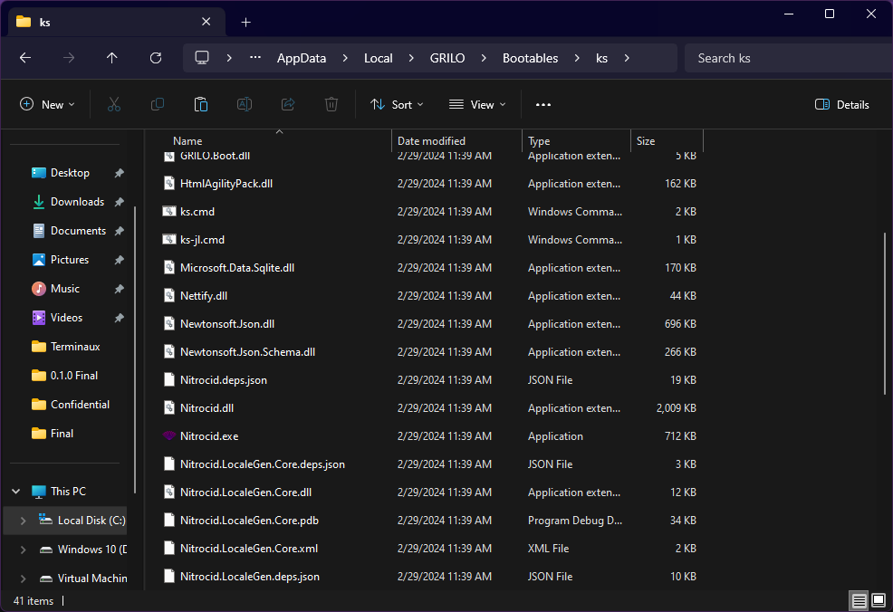
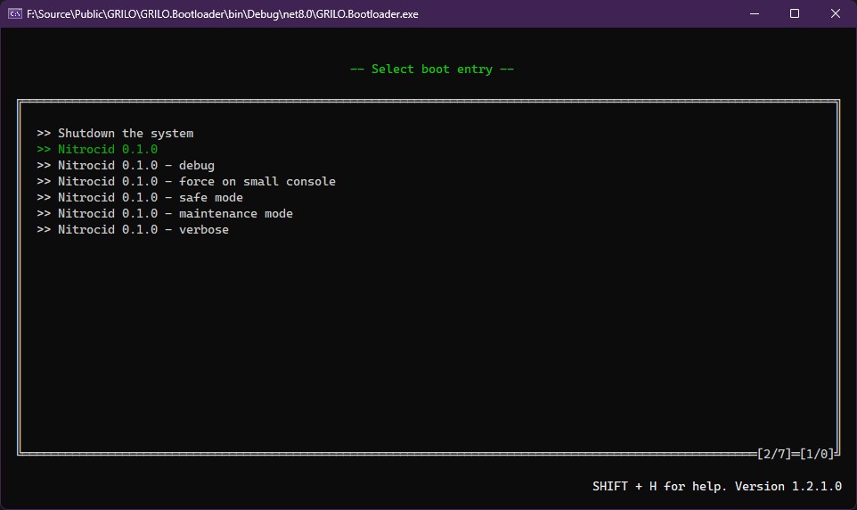

# 💿 Bootable Simulation

The GRILO bootloader simulator simulates the theory of the bootloaders and how they work in any device. It allows you to run any bootable .NET assemblies that implement the `IBootable` interface. To learn more about GRILO, visit the link below:


[GRILO - Manual](https://app.gitbook.com/o/fj052nYlsxW9IdL3bsZj/s/BLR1Eu9QDGfIEp3maSdB/)


## GRILO and KS

Nitrocid KS can be bootable using the simulated GRILO bootloader. To install Nitrocid KS to this bootloader simulator, follow the instructions below to get started. The bootable application installation paths may differ depending on the platform that you run KS on.

1. Download the Nitrocid KS release files from [this site](https://github.com/Aptivi/Kernel-Simulator/releases).
2.  Unpack the downloaded file to one of the paths, depending on the platform. You may need to create the below folders:

    * Windows: `%localappdata%/GRILO/Bootables/ks/`
    * Linux: `~/.config/grilo/Bootables/ks`

    <figure><figcaption></figcaption></figure>
3.  Start the GRILO bootloader (.NET 8.0), and choose one of the `Nitrocid` options\

    <figure><figcaption></figcaption></figure>

The kernel should boot up completely.


If the .NET 8.0 version of the kernel doesn't boot up correctly or induces erratic behavior due to missing dependencies, open the `BootMetadata.json` file on the Nitrocid directory and add the following line to all the Nitrocid boot entries as below:

<pre><code>[
    {
        "OverrideTitle": "Nitrocid 0.1.0",
        "Arguments": [ "noaltbuffer" ],
<strong>        "BootFilePath": "Nitrocid.dll"
</strong>    },
    (...)
</code></pre>



If you plan to run Nitrocid 0.0.24.x or lower using the .NET Framework version of GRILO, you'll have to use GRILO version 1.1.0 as it contains necessary fixes for dependency resolver.

Even though you have 1.1.0 installed, you'll still have to move all Nitrocid KS 0.0.24.x .NET Framework files from `Bootables` (.NET 6.0+) to `Bootables_DotNetFx` (.NET Framework 4.8).

